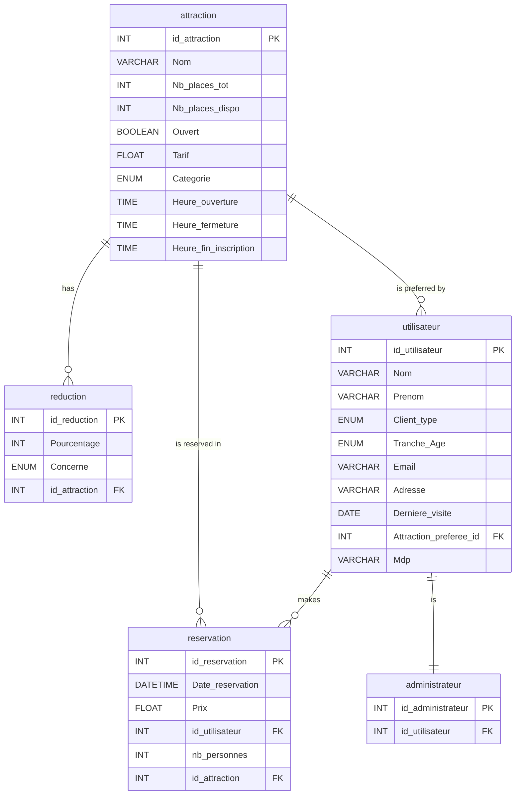

```mermaid
erDiagram
    attraction {
        INT id_attraction PK
        VARCHAR Nom
        INT Nb_places_tot
        INT Nb_places_dispo
        BOOLEAN Ouvert
        FLOAT Tarif
        ENUM Categorie
        TIME Heure_ouverture
        TIME Heure_fermeture
        TIME Heure_fin_inscription
    }

    reduction {
        INT id_reduction PK
        INT Pourcentage
        ENUM Concerne
        INT id_attraction FK
    }

    utilisateur {
        INT id_utilisateur PK
        VARCHAR Nom
        VARCHAR Prenom
        ENUM Client_type
        ENUM Tranche_Age
        VARCHAR Email
        VARCHAR Adresse
        DATE Derniere_visite
        INT Attraction_preferee_id FK
        VARCHAR Mdp
    }

    reservation {
        INT id_reservation PK
        DATETIME Date_reservation
        FLOAT Prix
        INT id_utilisateur FK
        INT nb_personnes
        INT id_attraction FK
    }

    administrateur {
        INT id_administrateur PK
        INT id_utilisateur FK
    }

    attraction ||--o{ reduction : "has"
    attraction ||--o{ utilisateur : "is preferred by"
    attraction ||--o{ reservation : "is reserved in"
    utilisateur ||--o{ reservation : "makes"
    utilisateur ||--|| administrateur : "is"

```
