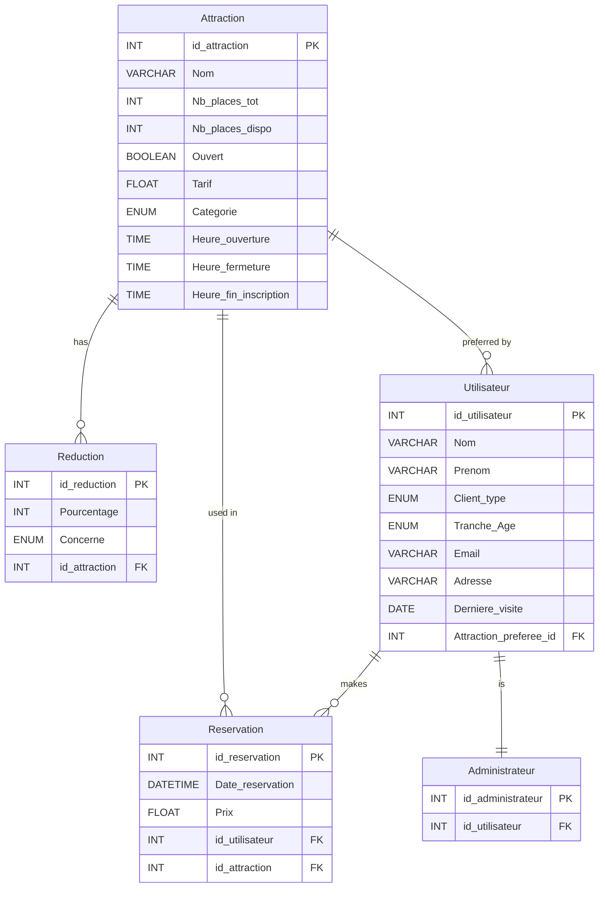

```mermaid
erDiagram
    Attraction {
        INT id_attraction PK
        VARCHAR Nom
        INT Nb_places_tot
        INT Nb_places_dispo
        BOOLEAN Ouvert
        FLOAT Tarif
        ENUM Categorie
        TIME Heure_ouverture
        TIME Heure_fermeture
        TIME Heure_fin_inscription
    }

    Reduction {
        INT id_reduction PK
        INT Pourcentage
        ENUM Concerne
        INT id_attraction FK
    }

    Utilisateur {
        INT id_utilisateur PK
        VARCHAR Nom
        VARCHAR Prenom
        ENUM Client_type
        ENUM Tranche_Age
        VARCHAR Email
        VARCHAR Adresse
        DATE Derniere_visite
        INT Attraction_preferee_id FK
    }

    Reservation {
        INT id_reservation PK
        DATETIME Date_reservation
        FLOAT Prix
        INT id_utilisateur FK
        INT id_attraction FK
    }

    Administrateur {
        INT id_administrateur PK
        INT id_utilisateur FK
    }

    Attraction ||--o{ Reduction : "has"
    Attraction ||--o{ Reservation : "used in"
    Attraction ||--o{ Utilisateur : "preferred by"
    Utilisateur ||--o{ Reservation : "makes"
    Utilisateur ||--|| Administrateur : "is"
```
