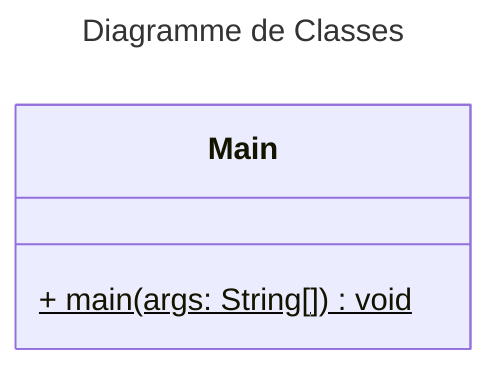

# :computer: Base-projet-Java

🌟 Highlights
Gestion complète de réservations d'attractions avec remises selon le type de client

Application Java respectant l'architecture MVC avec accès à la BDD via JDBC (pattern DAO)

Interface graphique intuitive pour clients et administrateurs

Génération de rapports statistiques (JFreeChart)

Système de connexion/inscription pour clients et administration des attractions

ℹ️ Overview

Ce projet a été développé dans le cadre du module Projet POO Java 2025.
L'application permet aux utilisateurs de réserver des attractions dans un parc en tenant compte des remises selon leur profil (membre, enfant, senior, etc.).
Les administrateurs peuvent mettre à jour les offres et consulter des statistiques de ventes.
Le projet utilise une base de données MySQL, une architecture MVC avec DAO et propose une interface graphique ergonomique en Java Swing.
Je suis étudiant en ingénierie informatique passionné par le développement logiciel et l’architecture d’applications. Ce projet est une occasion d'appliquer de bonnes pratiques professionnelles dans un environnement Java réel.

✍️ Authors

Robin KOENIG

Marius LEPERE

Sofia CAILLAUD

Marie ALLEMANDOU

⬇️ Installation

Prérequis :

Java 23+

MySQL Server

IntelliJ IDEA 

Bibliothèques : mysql-connector-java, JFreeChart, JavaFX

Instructions :

bash
Copier
Modifier
git clone https://github.com/ton-github/attractions-booking-app.git
cd attractions-booking-app
Importer le projet dans IntelliJ.

Configurer la connexion JDBC à votre base de données MySQL.

Exécuter le fichier principal pour démarrer l'application.

Assurez-vous d'avoir une base de données existante avec les tables nécessaires (Clients, Attractions, Reservations, etc.) et de bien paramétrer votre fichier .properties de connexion.

💭 Feedback and Contributing

Vous êtes invités à ouvrir une discussion pour toute suggestion, ou à ouvrir un issue pour signaler un bug ou proposer une amélioration.
Toute contribution est la bienvenue : n'hésitez pas à forker le projet, créer vos branches, et proposer vos pull requests !

# Diagramme de Classes

